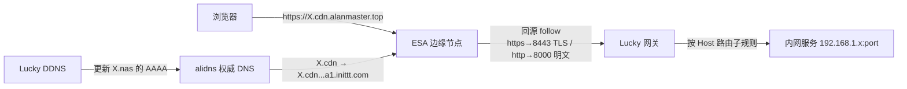

# EdgeLink

本地面板，把「Lucky 反向代理（Web 服务）」和「阿里云 ESA 加速」配好，实现域名免端口访问。

## 数据流



- **加速域名**：`X.cdn.alanmaster.top` 在 alidns 里 CNAME 到 ESA 节点（`X.cdn.alanmaster.top.a1.inittt.com`），请求进入 ESA 边缘。
- **回源**：ESA 回源规则 `follow`——https 走 Lucky 8443（TLS），http 走 8000（明文）。
- **路由**：Lucky 网关按请求 Host 匹配子规则，转发到对应内网服务。
- **解析**：`X.nas.alanmaster.top`（回源目标）由 Lucky DDNS 自动更新公网 IPv6。

## 功能

**页面**（左侧导航，hash 路由）：

- **概览**：运行状态（Lucky / ESA / 回源端口）+ 同步范围（全部 / 仅 Lucky / 仅 ESA）+ 一键执行同步
- **应用管理**：面板应用（外网域名 ↔ 内网服务映射）的增删改查、单应用同步、同步范围部署；下方「现存规则」面板
- **设置**：Lucky（OpenToken / 账号密码、安全入口）、阿里云 ESA（AccessKey、站点）、回源网关（监听、端口、回源协议、TLS、超时）
- **日志**：执行日志

**现存规则**（应用管理页）：

- **Lucky 列表**：读取 Lucky 现存子规则（域名、回源目标、备注、端口、状态）；面板管理的（`lucky-esa-` 前缀）可导入为应用；每条的「开通 ESA」一键完成两步——ESA 创建加速域名记录 + alidns 添加 CNAME（幂等）
- **ESA 列表**：加速域名（DNS 记录）+ 回源规则

**认证**：

- **Lucky**：优先 OpenToken（后台设置生成，请求头 `OpenToken: <token>`），无则账号密码登录。适配 Lucky v3 的 `/api/webservice/*` API。
- **ESA**：AccessKey（建议 `AliyunESAFullAccess`）。

## 环境要求

- Node.js 18+
- Lucky 后台可访问（默认 `http://127.0.0.1:16601`，如设了安全入口路径则填写）
- 阿里云 ESA AccessKey；已备案域名并完成 ESA 站点接入
- 加速域名所在的权威 DNS 在阿里云 DNS（alidns）——「开通 ESA」自动写 CNAME 依赖它（凭据读取自 Lucky DDNS 任务）

## 启动

```bash
npm install
npm start
```

默认地址：<http://127.0.0.1:8787>

服务默认监听 `0.0.0.0`（局域网可访问）。**面板无登录鉴权**：任何能访问面板的人都能改配置、加应用、触发部署，仅限可信网络使用，不要暴露公网。凭据存于 `config.json`（已 `.gitignore`），API 返回时密码 / AccessKey / OpenToken 以 `********` 掩码。

## 使用

1. **确定域名规则**：先规划外网域名与内网服务的映射（这是规则的源头，Lucky/ESA 都围绕域名服务）。在「应用管理」添加应用（外网域名、回源域名、回源 Host、内网服务），或从「现存规则 → Lucky」导入/开通 ESA。
2. **设置**：填 Lucky 地址（+安全入口路径）+ OpenToken（或账号密码），点「测试连接」；填 ESA AccessKey，刷新站点并选择；确认回源网关参数（监听端口、回源协议；选 `follow` 时填「回源 http 端口」）。
3. **概览**：选同步范围，点「执行同步」；或对单个应用点「同步」。

## 说明

- 面板管理的 Lucky 子规则以 `lucky-esa-` 前缀标识，非面板规则保留不动。
- ESA 回源规则名以 `lucky-esa-` 前缀标识；手动规则（如全局 `emby`，`rule=true` 匹配全部流量）不删改。
- 回源协议 `follow` 时：ESA 规则 http 端口用网关「回源 http 端口」（默认 8000）、https 端口用监听端口（默认 8443），对应 Lucky 双监听（8443 TLS + 8000 明文）。
- 现存 Lucky 手动规则不开通 ESA 时也可直接访问（未配 alidns CNAME 则域名不解析）。

## 测试

```bash
npm test
```
